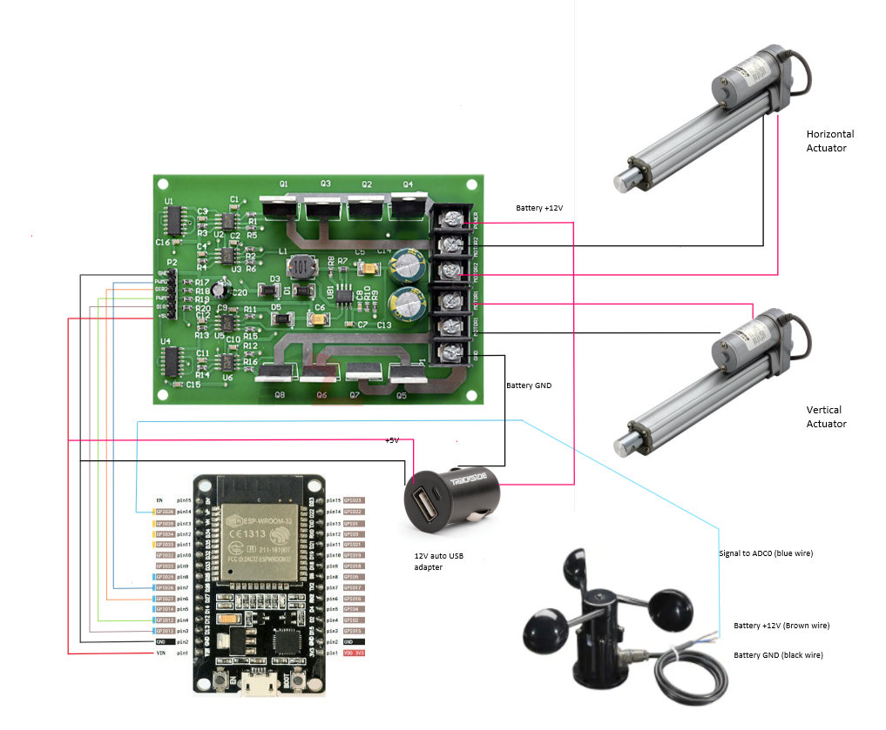

# SkyeTracker

## Dual Axis solar tracker.

This project uses a pair of linear actuators to move a set of solar panels so that they face the sun throughout the day.
Knowing the latitude, longitude and the date/time, the software calculates the azimuth and elevation of the sun. The system is setup and calibrated using an Android app that communicates with the device using the Bluetooth interface. It has support for an anemometer, moving the solar panel array to horizontal position when the wind exceeds 30km/h.

Check the <a href='https://github.com/ClassicDIY/SkyeTracker/wiki'> wiki </a> for more information.

Here are some <a href='https://www.youtube.com/playlist?list=PLblHpNAh7b6LoXEqofkJhKn6jD81Y85qT'> videos </a>.

  
  

## SkyeTracker Wiring (Lilygo-T-Relay-S3)

New version 3 for the <a href='https://lilygo.cc/products/t-relay-s3'>Lilygo T-Relay-S3</a>

Note: Bluetooth is no longer supported on the ESP32-S3, support for the Android app has been removed.
The settings can be accessed via the Wifi Access Point, default AP: SkyeTracker default admin PW: 12345678

  

  

  

  

## SkyeTracker Wiring (ESP32 version 2)

Check the [wiki](https://github.com/ClassicDIY/SkyeTracker/wiki/3---ESP32-wiring-diagram) for updated information on the ESP32 implementation.

  

## Development tools:

<ul>
  <li>Visual Studio Code with PlatformIO IDE extension.</li>
  <li>Diptrace for schematic & PCB (NANO version).</li>
  <li>Sketchup for mechanical drawings.</li>
</ul>

